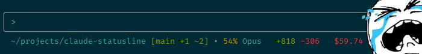

# Claudia Statusline

*Enhanced statusline for Claude Code - track costs, git status, and context usage in real-time*

[](https://github.com/hesreallyhim/awesome-claude-code)



A high-performance statusline for [Claude Code](https://docs.anthropic.com/en/docs/claude-code) that shows you workspace info, git status, model usage, session costs, and more.

**Example output:**
```
~/myproject [main +2 ~1 ?3] • 45% [====------] Sonnet • 1h 23m • +150 -42 • $3.50 ($2.54/h)
```

## Quick Install

```bash
curl -fsSL https://raw.githubusercontent.com/hagan/claudia-statusline/main/scripts/quick-install.sh | bash
```

**That's it!** The installer downloads the right binary, installs it, and configures Claude Code automatically.

**Need help?** See [Installation Guide](docs/INSTALLATION.md) for all platforms and options.

## What You Get

- **Current directory** with `~` shorthand
- **Git branch and changes** (+2 added, ~1 modified, ?3 untracked)
- **Context usage** with progress bar (45% [====------])
- **Real-time compaction detection** (experimental) - instant feedback via hooks (~600x faster)
  - Normal: `79% [========>-] ⚠` (warning when approaching limit)
  - In Progress: `Compacting... ⠋` (hook-based, <1ms detection)
  - Completed: `35% [===>------] ✓` (checkmark after successful compact)
- **Claude model** (O4.5/S4.5/H4.5 - consistent version display)
- **Session duration** (1h 23m)
- **Cost tracking** ($3.50 session, $2.54/hour burn rate)
- **Lines changed** (+150 added, -42 removed)

**Automatic features:**
- Persistent cost tracking across sessions
- Multi-console safe (run multiple Claude instances)
- **11 embedded themes** (dark, light, monokai, solarized, high-contrast, gruvbox, nord, dracula, one-dark, tokyo-night, catppuccin)
- **5 layout presets** (default, compact, detailed, minimal, power) with custom template support
- **4 model formats** (abbreviation: O4.5, full: Claude Opus 4.5, name: Opus, version: 4.5)
- SQLite database for reliability
- **Token rate metrics** (opt-in) - display tokens/second with cache efficiency tracking
- **Hook-based compaction detection** (experimental, opt-in) - instant real-time feedback via Claude Code hooks
- **Adaptive context learning** (experimental, opt-in) - learns actual context limits by observing usage
- No configuration needed (smart defaults)

## Documentation

- **[Installation Guide](docs/INSTALLATION.md)** - All platforms, build from source, troubleshooting
- **[Usage Guide](docs/USAGE.md)** - Commands, examples, JSON format, embedding API
- **[Configuration Guide](docs/CONFIGURATION.md)** - Themes, retention, git timeout, advanced settings
- **[Adaptive Learning Guide](docs/ADAPTIVE_LEARNING.md)** - Automatic context limit learning (experimental)
- **[Cloud Sync Guide](docs/CLOUD_SYNC.md)** - Turso setup for cross-machine stats (experimental)
- **[Database Migrations](docs/DATABASE_MIGRATIONS.md)** - Schema versioning and migrations

**Project docs:**
- **[ARCHITECTURE.md](ARCHITECTURE.md)** - Technical architecture and module design
- **[CONTRIBUTING.md](CONTRIBUTING.md)** - Development guidelines and debugging
- **[SECURITY.md](SECURITY.md)** - Security policies and vulnerability reporting
- **[CHANGELOG.md](CHANGELOG.md)** - Version history and release notes
- **[WINDOWS_BUILD.md](WINDOWS_BUILD.md)** - Windows-specific build instructions

## Quick Start

### 1. Install

```bash
curl -fsSL https://raw.githubusercontent.com/hagan/claudia-statusline/main/scripts/quick-install.sh | bash
```

### 2. Restart Claude Code

The statusline appears automatically - no configuration needed!

### 3. (Optional) Customize

```bash
# Change theme
export CLAUDE_THEME=light  # or dark (default)

# Disable colors
export NO_COLOR=1

# Advanced config
vim ~/.config/claudia-statusline/config.toml
```

**Layout Presets** - Choose from 5 built-in layouts:

| Preset | Output |
|--------|--------|
| `default` | `~/project • main +2 • 75% [======>---] • S4.5 • $12.50` |
| `compact` | `project main S4.5 $12` |
| `detailed` | Two-line with context on second line |
| `minimal` | `~/project S4.5` |
| `power` | Multi-line with all details |

```toml
# ~/.config/claudia-statusline/config.toml
[layout]
preset = "compact"  # Or create custom: format = "{directory} {model}"
```

See [Configuration Guide](docs/CONFIGURATION.md) for all options including per-component customization.

## Common Questions

<details>
<summary><b>How much does it cost?</b></summary>

Nothing! It's free and open source (MIT license). The cost tracking shows your Claude API usage costs.
</details>

<details>
<summary><b>Will this slow down Claude Code?</b></summary>

No. The binary is designed to refresh quickly while staying out of the way—the hot path completes in a few milliseconds on typical hardware and keeps CPU usage negligible.
</details>

<details>
<summary><b>Where is my data stored?</b></summary>

Locally in `~/.local/share/claudia-statusline/stats.db`. Nothing leaves your machine unless you enable cloud sync.
</details>

<details>
<summary><b>Can I sync stats across machines?</b></summary>

Yes! Download the [Turso variant](https://github.com/hagan/claudia-statusline/releases/latest) and see [Cloud Sync Guide](docs/CLOUD_SYNC.md) for setup.
</details>

<details>
<summary><b>Does this work on Windows?</b></summary>

Yes! Download the [Windows binary](https://github.com/hagan/claudia-statusline/releases/latest/download/statusline-windows-amd64.zip) and see [Windows Guide](WINDOWS_BUILD.md).
</details>

<details>
<summary><b>How do I uninstall?</b></summary>

```bash
./scripts/uninstall-statusline.sh
# Or manually: rm ~/.local/bin/statusline
```

See [Installation Guide](docs/INSTALLATION.md#uninstallation) for details.
</details>

## Manual Download

Download for your platform from [latest release](https://github.com/hagan/claudia-statusline/releases/latest):

| Platform | Standard | Turso Sync |
|----------|----------|------------|
| **Linux x86_64** | [Download](https://github.com/hagan/claudia-statusline/releases/latest/download/statusline-linux-amd64.tar.gz) | [Download](https://github.com/hagan/claudia-statusline/releases/latest/download/statusline-turso-linux-amd64.tar.gz) |
| **macOS Intel** | [Download](https://github.com/hagan/claudia-statusline/releases/latest/download/statusline-darwin-amd64.tar.gz) | [Download](https://github.com/hagan/claudia-statusline/releases/latest/download/statusline-turso-darwin-amd64.tar.gz) |
| **macOS Apple Silicon** | [Download](https://github.com/hagan/claudia-statusline/releases/latest/download/statusline-darwin-arm64.tar.gz) | [Download](https://github.com/hagan/claudia-statusline/releases/latest/download/statusline-turso-darwin-arm64.tar.gz) |
| **Windows** | [Download](https://github.com/hagan/claudia-statusline/releases/latest/download/statusline-windows-amd64.zip) | [Download](https://github.com/hagan/claudia-statusline/releases/latest/download/statusline-turso-windows-amd64.zip) |

**Standard**: Local-only, recommended for most users
**Turso Sync**: Includes cloud sync features (experimental, requires setup)

Then extract and install:
```bash
tar xzf statusline-*.tar.gz
mv statusline ~/.local/bin/
```

See [Installation Guide](docs/INSTALLATION.md) for detailed instructions.

## Troubleshooting

**"statusline not found"** after install?
```bash
export PATH="$HOME/.local/bin:$PATH"
# Add to ~/.bashrc or ~/.zshrc to persist
```

**macOS says "cannot be opened"?**
```bash
xattr -d com.apple.quarantine ~/.local/bin/statusline
```

**Statusline shows only "~"?**
```bash
# Re-run installer to fix configuration
curl -fsSL https://raw.githubusercontent.com/hagan/claudia-statusline/main/scripts/quick-install.sh | bash
```

**Burn rate shows unrealistic values (e.g., $800+/hr)?**

This can happen with `auto_reset` mode when a session resets after inactivity. The accumulated cost from before the reset briefly appears with a very short duration, causing a spike. This is transient and corrects itself as the session progresses. If it persists, check your database with `statusline health`.

**Daily/monthly cost totals seem wrong?**

The stats database may have accumulated incorrect values. Rebuild from actual session data:
```bash
sqlite3 ~/.local/share/claudia-statusline/stats.db "
DELETE FROM daily_stats;
DELETE FROM monthly_stats;
INSERT INTO daily_stats (date, total_cost, total_lines_added, total_lines_removed, session_count)
SELECT date(start_time, 'localtime'), SUM(cost), SUM(lines_added), SUM(lines_removed), COUNT(*)
FROM sessions GROUP BY date(start_time, 'localtime');
INSERT INTO monthly_stats (month, total_cost, total_lines_added, total_lines_removed, session_count)
SELECT strftime('%Y-%m', start_time, 'localtime'), SUM(cost), SUM(lines_added), SUM(lines_removed), COUNT(*)
FROM sessions GROUP BY strftime('%Y-%m', start_time, 'localtime');
"
```

**More help?** See [Installation Guide](docs/INSTALLATION.md#troubleshooting) and [Usage Guide](docs/USAGE.md#troubleshooting)

## Advanced Features

<details>
<summary><b>Database Maintenance</b></summary>

Keep your stats database optimized:

```bash
statusline db-maintain
```

Schedule with cron:
```bash
# Daily at 3 AM
0 3 * * * /path/to/statusline db-maintain --quiet
```

See [Usage Guide](docs/USAGE.md#database-maintenance) for details.
</details>

<details>
<summary><b>Configurable Burn Rate</b></summary>

**New in v2.21.0**: Choose how session duration is calculated for accurate cost-per-hour tracking.

**The Problem:** Multi-day sessions include idle time (nights, weekends), showing artificially low burn rates:
- $8.99 over 22 days = $0.02/hr ❌
- $8.99 over 5 hours active = $1.80/hr ✅

**Three modes available:**

| Mode | Best For | Example |
|------|----------|---------|
| **wall_clock** (default) | Quick sessions, backward compatibility | $3.50 / 7h = $0.50/hr |
| **active_time** | Multi-day projects, accurate active rate | $12.00 / 6h active = $2.00/hr |
| **auto_reset** | Separate daily sessions, distinct work periods | Each session tracked independently |

**Configure in `~/.config/claudia-statusline/config.toml`:**
```toml
[burn_rate]
mode = "active_time"  # or "wall_clock" or "auto_reset"
inactivity_threshold_minutes = 60  # Default: 1 hour
```

**Active time mode** automatically excludes idle gaps ≥ threshold (default: 60 min):
- Tracks time between consecutive messages
- Excludes nights, weekends, long breaks
- Shows realistic $/hour for actual work

**Auto-reset mode** archives and resets session after inactivity:
- Automatically archives old session to `session_archive` table
- Resets counters (cost, lines, duration) to zero
- Daily/monthly stats continue to accumulate
- Great for consultants tracking multiple work periods
- History preserved for analytics

See [Configuration Guide](docs/CONFIGURATION.md#burn-rate-configuration) for complete details and examples.
</details>

<details>
<summary><b>Token Rate Metrics (Opt-in)</b></summary>

**Display token usage rates in tokens per second** to understand consumption patterns during intensive sessions.

**Disabled by default** - explicitly enable in config:

```toml
[token_rate]
enabled = true                      # Opt-in feature
display_mode = "detailed"           # "summary", "detailed", or "cache_only"
rate_display = "output_only"        # "both", "output_only", or "input_only"
cache_metrics = true                # Show cache hit ratio and ROI
rate_window_seconds = 60            # Rolling window (0 = session average)
```

> **⚠️ Requires SQLite**: Token rates require `json_backup = false` (SQLite-only mode).
> Run `statusline migrate --finalize` if you haven't migrated yet.

**Three display modes:**

| Mode | Example Output | Best For |
|------|----------------|----------|
| **summary** | `13.9 tok/s` | Clean, minimal display |
| **detailed** | `In:5.2 Out:8.7 tok/s • Cache:85%` | Full token breakdown |
| **cache_only** | `Cache:85% (12x ROI) • 41.7 tok/s` | Cache efficiency focus |

**Key features:**
- **Rolling window**: Output rate uses last N seconds for responsive updates
- **Hybrid approach**: Input rate = session average, Output rate = rolling window
- **Configurable display**: Show both rates, output only, or input only
- Shows cache hit ratio and ROI (return on investment)
- Session/daily totals remain accurate from database

**Example calculations:**
- 50,000 tokens / 3600 seconds = **13.9 tok/s**
- Cache ROI of 12x means cache reads saved 12× the cost of creating cache
- Hit ratio of 85% means 85% of requests were served from cache

See [Configuration Guide](docs/CONFIGURATION.md#token-rate-configuration) for details.
</details>

<details>
<summary><b>Adaptive Context Learning</b></summary>

Experimental feature that learns actual context window limits by observing usage:

```bash
# Check learning status
statusline context-learning --status

# View detailed observations
statusline context-learning --details

# Reset learned data
statusline context-learning --reset

# Rebuild from session history
statusline context-learning --rebuild
```

**Enable in config:**
```toml
[context]
adaptive_learning = true
learning_confidence_threshold = 0.7
```

> **⚠️ Requires SQLite**: Context learning requires `json_backup = false` (SQLite-only mode).

See [Adaptive Learning Guide](docs/ADAPTIVE_LEARNING.md) for complete documentation.
</details>

<details>
<summary><b>Cloud Sync</b></summary>

Track costs across multiple machines:

1. Download [Turso variant](https://github.com/hagan/claudia-statusline/releases/latest)
2. Create free [Turso](https://turso.tech/) account
3. Configure sync in `~/.config/claudia-statusline/config.toml`
4. Push/pull stats: `statusline sync --push` / `statusline sync --pull`

See [Cloud Sync Guide](docs/CLOUD_SYNC.md) for complete setup.
</details>

<details>
<summary><b>Building from Source</b></summary>

For developers or latest features:

```bash
git clone https://github.com/hagan/claudia-statusline
cd claudia-statusline
./scripts/install-statusline.sh

# Or manual build
cargo build --release

# Build with Turso sync
cargo build --release --features turso-sync
```

**Requirements**: Rust 1.70+ ([install](https://rustup.rs/))

See [Installation Guide](docs/INSTALLATION.md#building-from-source) for details.
</details>

<details>
<summary><b>Hook-Based Compaction Detection (Experimental)</b></summary>

Get **instant real-time feedback** when Claude compacts your context (~600x faster than token-based detection):

```json
// Configure Claude Code hooks (in ~/.claude/settings.json or settings.local.json):
{
  "hooks": {
    "PreCompact": [
      {
        "hooks": [
          {
            "type": "command",
            "command": "statusline hook precompact"
          }
        ]
      }
    ],
    "SessionStart": [
      {
        "matcher": "compact",
        "hooks": [
          {
            "type": "command",
            "command": "statusline hook postcompact"
          }
        ]
      }
    ]
  }
}
```

**How it works:**
1. Claude fires `PreCompact` hook when compaction starts
2. Statusline shows "Compacting..." instead of percentage
3. Claude fires `SessionStart[compact]` when compaction completes
4. Statusline returns to normal display
5. Falls back to token-based detection if hooks not configured

> **Note**: Claude Code doesn't have a dedicated `PostCompact` hook. Use
> `SessionStart` with matcher `"compact"` which fires after compaction.

**Benefits:**
- <1ms detection vs 60s+ token analysis
- Real-time visual feedback
- Zero overhead (event-driven)

See [Hook Commands](docs/USAGE.md#hook-commands) in the Usage Guide for complete setup details.
</details>

<details>
<summary><b>Themes & Colors</b></summary>

Choose from **11 embedded themes** or create your own:

```bash
# Built-in themes
export STATUSLINE_THEME=dark          # Default dark theme
export STATUSLINE_THEME=light         # Light terminal optimized
export STATUSLINE_THEME=monokai       # Vibrant Sublime Text colors
export STATUSLINE_THEME=solarized     # Precision colors by Ethan Schoonover
export STATUSLINE_THEME=high-contrast # WCAG AAA accessibility
export STATUSLINE_THEME=gruvbox       # Retro groove with warm colors
export STATUSLINE_THEME=nord          # Arctic, north-bluish palette
export STATUSLINE_THEME=dracula       # Dark theme with vibrant purples
export STATUSLINE_THEME=one-dark      # Atom's iconic dark theme
export STATUSLINE_THEME=tokyo-night   # Deep blue inspired by Tokyo's skyline
export STATUSLINE_THEME=catppuccin    # Soothing pastel (Mocha variant)

# Disable colors entirely
export NO_COLOR=1
```

**Theme highlights:**
- **Monokai**: Bold, saturated colors for visual impact
- **Solarized**: Scientifically designed for reduced eye strain
- **High-Contrast**: 7:1+ contrast ratios for accessibility
- **Gruvbox**: Warm, retro-inspired earthy tones
- **Nord**: Cool arctic color palette with muted blues
- **Dracula**: Popular dark theme with vibrant purple and pink accents
- **One Dark**: Balanced, professional colors from Atom editor
- **Tokyo Night**: Deep blue neon-inspired colors
- **Catppuccin**: Soft, warm pastel colors (Mocha dark variant)

**Custom themes:**
Create `~/.config/claudia-statusline/mytheme.toml`:
```toml
name = "mytheme"
description = "My custom theme"

[colors]
directory = "#00AAFF"
git_branch = "#00FF00"
cost_high = "#FF0000"
# ... see themes/ for full examples
```

Then: `export STATUSLINE_THEME=mytheme`

See [Configuration Guide](docs/CONFIGURATION.md#theme-customization) for complete theme reference.
</details>

## Development & Testing

When developing or testing statusline, it's important to keep test data separate from your production database to avoid pollution. We provide several tools for safe testing:

### Test Mode (Recommended)

Use the `--test-mode` flag for automatic isolation:

```bash
# Run with isolated test database and TEST indicator
echo '{"workspace":{"current_dir":"/tmp"}}' | statusline --test-mode
```

This automatically:
- Uses a separate database at `~/.local/share-test/claudia-statusline/stats.db`
- Adds a yellow `[TEST]` indicator to the output
- Prevents any modifications to your production database

### Manual Testing with Make

The project includes convenient Makefile targets:

```bash
# Run with isolated test database (builds binary first)
make test-manual

# Show database paths and status
make show-db-path

# Clean test database
make clean-test
```

### Environment Variable Approach

For more control, use environment variables directly:

```bash
# Use test database for this session
export XDG_DATA_HOME="$HOME/.local/share-test"
echo '{"workspace":{"current_dir":"/tmp"}}' | statusline

# Or as a one-liner
XDG_DATA_HOME=~/.local/share-test statusline < test_input.json

# Add to ~/.zshrc for quick access
alias statusline-test='XDG_DATA_HOME=~/.local/share-test statusline'
```

### Best Practices

1. **Always use test mode** when experimenting with new features
2. **Never manually create test data** in the production database
3. **Use separate config files** for testing:
   ```bash
   statusline --test-mode --config ~/.config/claudia-statusline/config.test.toml
   ```
4. **Clean up after testing**:
   ```bash
   make clean-test  # or manually: rm -rf ~/.local/share-test/claudia-statusline
   ```

### Running Tests

```bash
# Run all tests (unit + integration)
make test

# Run specific test suite
cargo test test_test_mode  # Test the test-mode feature

# Run with verbose output
cargo test -- --nocapture
```

For more details, see [CONTRIBUTING.md](CONTRIBUTING.md).

## Contributing

We welcome contributions! Please see:

- **[Issues](https://github.com/hagan/claudia-statusline/issues)** - Bug reports and feature requests
- **[Discussions](https://github.com/hagan/claudia-statusline/discussions)** - Questions and ideas
- **[Contributing Guide](CONTRIBUTING.md)** - Development guidelines
- **[Security Policy](SECURITY.md)** - Reporting vulnerabilities

## Credits

**Original Inspiration**: [Peter Steinberger's statusline.rs](https://gist.github.com/steipete/8396e512171d31e934f0013e5651691e)

**Current Implementation**: Complete Rust rewrite with persistent stats, cloud sync, and enhanced features.

**License**: MIT - See [LICENSE](LICENSE)

---

**Made with ❤️ for the Claude Code community**

*"Claudia" - because every AI assistant deserves a companion!*
